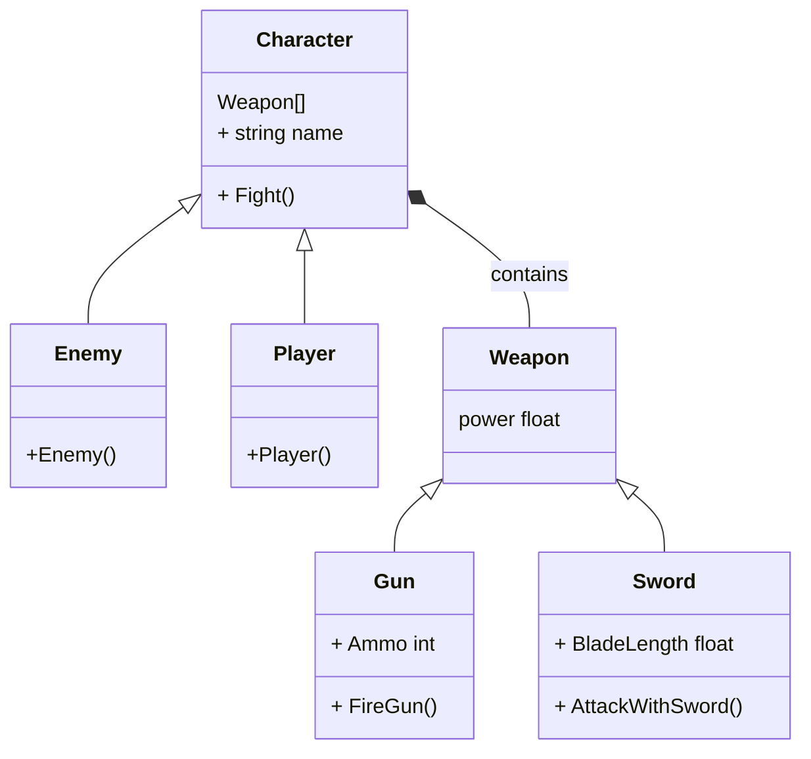

# MiniGame

```mermaid
classDiagram
    class Character {
        Weapon[]
        + string name
        + Fight()
    }

    class Enemy{
        +Enemy()
    } 
    class Player{
        +Player()
    } 

    class Weapon {
        power float
    }

    class Gun {
        + Ammo int
        + FireGun()
    }

    class Sword {
        + BladeLength float
        + AttackWithSword()
    }

    Character <|-- Enemy
    Character <|-- Player
    Character *-- Weapon : contains
    Weapon <|-- Gun
    Weapon <|-- Sword
```